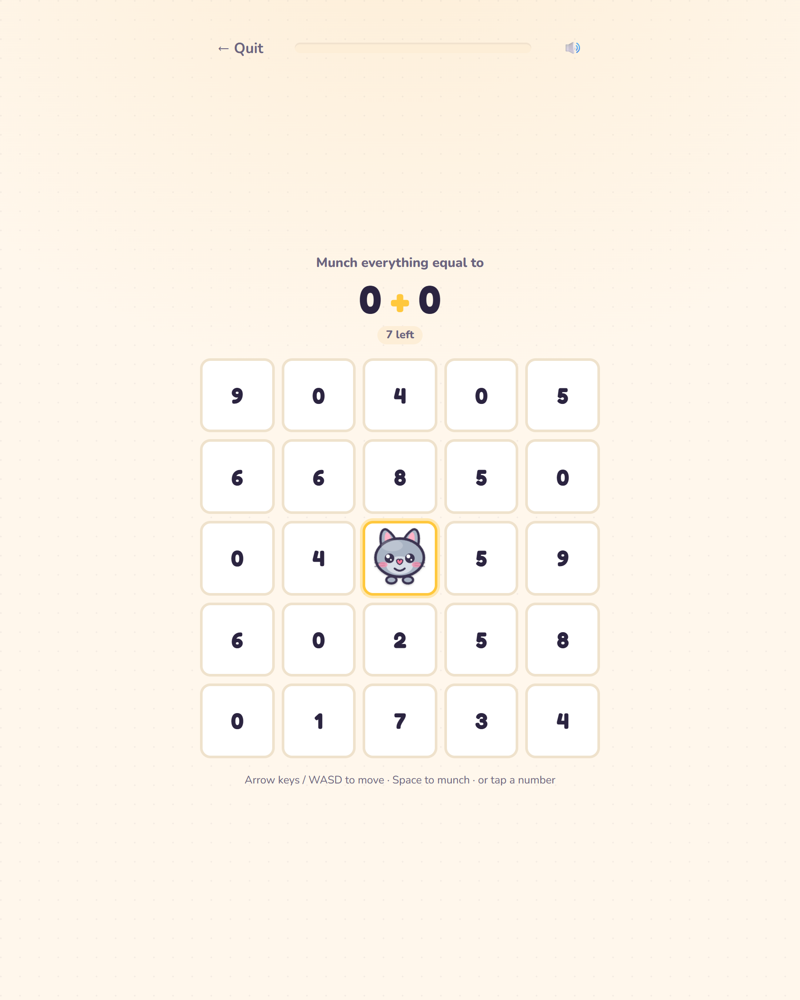
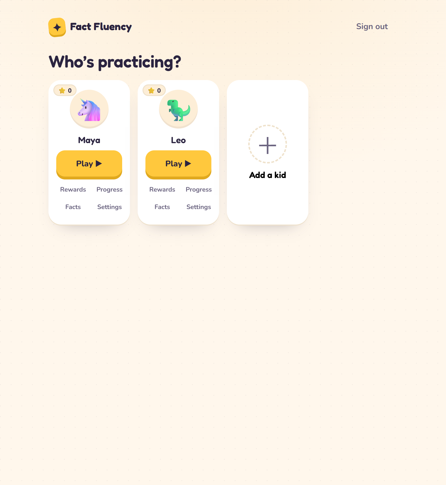
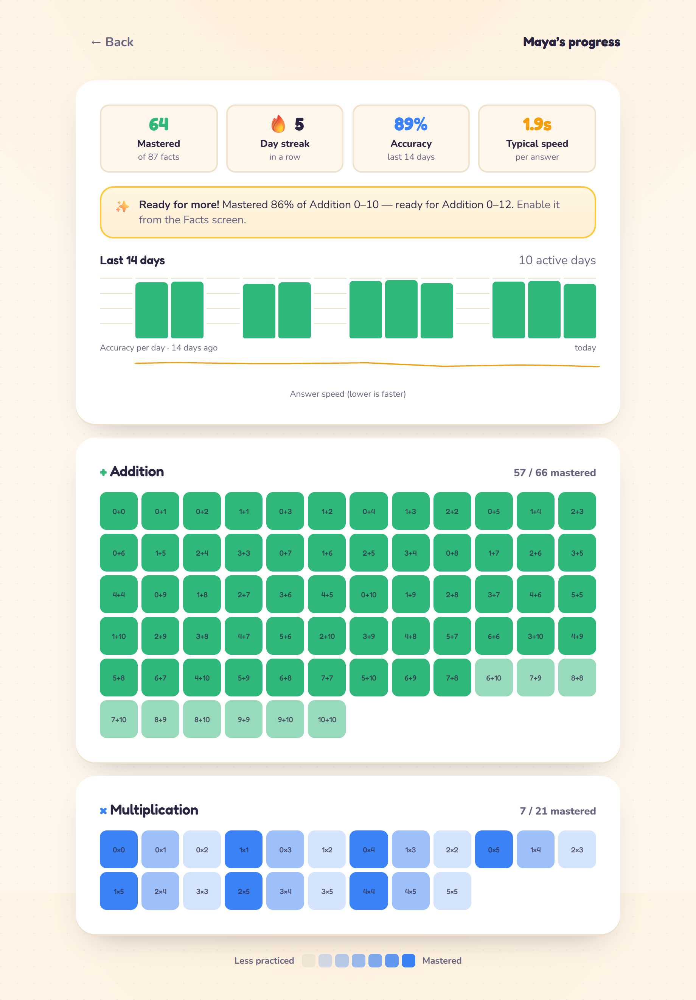
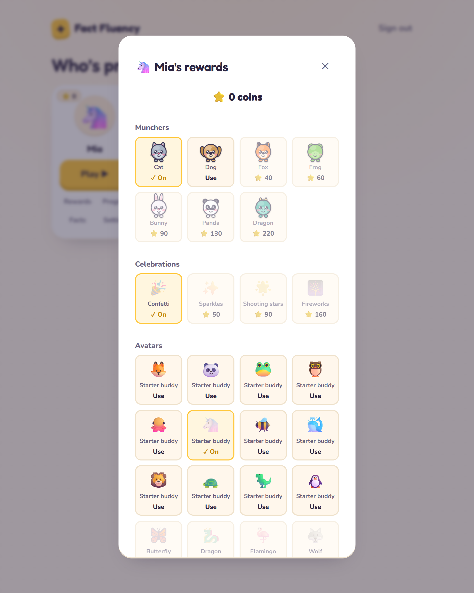

# Fact Fluency

A browser-based **math fact fluency** game for kids. It builds genuine
automaticity in the four operations through **spaced repetition** with a
**fluency gate** (a fact is only mastered when answered _correctly **and**
fast_), wrapped in a **Number Munchers–style** grid game so practice feels like
play, not a worksheet.

An adult (parent/teacher) account holds multiple kid profiles; kids just tap
their avatar and play — no logins for them.

### ▶️ Try it live

**https://fact-fluency.onrender.com**

> Runs on Render's free tier, so the first request after it's been idle may take
> ~50s to cold-start. Sign up with any email (it's a demo) to create a profile.

---

## Screenshots

**Number Munchers play** — munch every cell that's `= / < / >` the fact, with a
muncher you drive by keyboard or tap (shown here in the unlockable _Ocean_ theme):



| Profile picker                                | Adult dashboard                                 | Rewards shop                                |
| --------------------------------------------- | ----------------------------------------------- | ------------------------------------------- |
|  |  |  |

---

## What's inside

- **Spaced-repetition + fluency engine** — Leitner boxes for the across-session
  schedule, an in-session rehearsal queue, and a per-kid adaptive speed
  threshold that also throttles new-fact intake when recent accuracy dips. All
  pure, framework-free, and the most-tested code in the repo (constants are
  env-tunable for calibration).
- **Number Munchers play mode** — a 5×5 grid; munch everything equal to /
  smaller than / bigger than the fact's answer. Calm and non-punitive (no
  chasing enemies, no on-screen countdown); K–1 profiles start equality-only. A
  missed fact gets a warm derivation strategy on its study card.
- **Multiplayer games** — a **Race** mode (chase an async ghost of your own best
  run, or live WebSocket rooms), and **Number Feast**, a real-time
  "sushi-go-round" arena (grab the plates matching the fact for points, bump
  your rivals; solo-vs-bots or live). Both are non-punitive and never touch the
  spaced-repetition schedule — only coins.
- **Adult dashboard** — 14-day accuracy & speed trends, a mastery summary, a
  "This week" recap, the trickiest facts right now (with a printable practice
  worksheet), curriculum-standards labels, and a one-tap "Enable now" next-set
  suggestion. Fully-mastered operations get a printable certificate.
- **Rewards** — coins earned per session unlock munchers, celebration effects,
  avatars (some seasonal), palette themes, and a streak-shield power-up that
  saves a streak across one missed day — all shown in a collectible **sticker
  book** gallery.
- **Fact grid, daily streaks, fact-family transfer** (mastering `56 ÷ 7` seeds
  and nudges `7 × 8` on the review schedule).
- **PWA + offline-resilient sync** — installable (real maskable/apple icons); a
  flaky connection never loses practice (answers queue locally, replay on
  reconnect, and missed facts still get their in-session re-show offline).
- **Localized in four languages** — English, Spanish, French, and Simplified
  Chinese (device-level, with a switcher); even server-generated prose is
  localized.
- **Accessible & friendly** — on-device **narrated audio** for pre/emerging
  readers, a calm (no-timer) mode, easy-read font and high-contrast toggles,
  screen-reader announcements (including per-munch feedback), roving-tabindex
  keyboard play, sound with a mute toggle, and `prefers-reduced-motion` support.
- **Transparent by design** — a public [`/how-it-works`](https://fact-fluency.onrender.com/how-it-works)
  methodology page explains the learning science honestly (no invented efficacy
  claims), with a clear promise on children's data.
- **Built to survive a bad network** — the live games ride a liveness heartbeat
  and reconnect cleanly; a dropped socket gets you a way out instead of a frozen
  screen; answers are idempotent, so a replayed report can't double-count; and
  time the app spent backgrounded never counts against a kid's response time.

See **[DESIGN.md](DESIGN.md)** for the full product/architecture rationale and
**[CLAUDE.md](CLAUDE.md)** for the quick operational reference.

## Tech stack

- **Frontend:** Vite + React + TypeScript
- **Backend:** Node + Express + TypeScript, cookie-based adult auth (argon2id,
  server-side sessions; auth endpoints are rate-limited)
- **DB:** SQLite for local/dev, Postgres for deploy — swappable behind one DB
  adapter interface
- **Deploy:** a single Render service serves the built SPA + the API

npm-workspaces monorepo: `shared` (type-only DTOs) · `server` (API + pure
engine) · `client` (SPA).

## Run locally

Requires Node `24.x` (see `.node-version`).

```bash
npm install        # install all workspaces
npm run dev        # Express API on :3001 + Vite on :5173 (/api proxied)
```

Open http://localhost:5173 and sign up. By default it uses a local SQLite file
(`server/data/fact-fluency.sqlite`); no other setup needed.

### Other commands

```bash
npm test           # engine + API + client tests (vitest) — no services needed
npm run test:pg    # Db contract against a real Postgres 16 (needs Docker)
npm run typecheck  # tsc --noEmit across all three workspaces
npm run build      # shared (tsc) → server (esbuild) → client (vite build)
npm start          # production: serve the built SPA + API from one process
```

`npm test` is the everyday gate and needs nothing installed beyond the repo. The
two database adapters share **one** behavioral contract suite, run against
SQLite and pg-mem there — and against a **real Postgres in Docker** via
`npm run test:pg`, which starts the container, waits for it, and tears it down.
That extra layer exists because pg-mem is a reimplementation and quietly differs
from the real thing (it ignores `COUNT(*) FILTER` and can't honor `ROLLBACK`),
so anything touching SQL should run it.

Config is via env (`.env.example`): `PORT`, `DATABASE_URL` (the scheme —
`sqlite:` vs `postgres://` — selects the adapter).

## Deploy (Render)

`render.yaml` is a Blueprint: one Node web service serving the built SPA + API,
backed by a managed Postgres. See [RENDER.md](RENDER.md) for setup,
troubleshooting, and database recreation.
